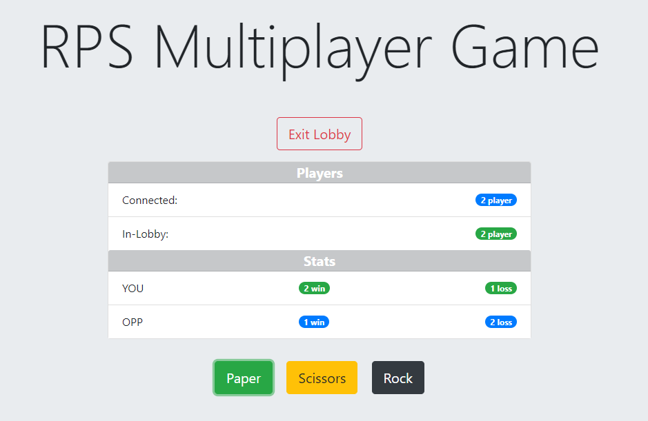

# RPS-Multiplayer using Firebase

## Overview:
This application is a Rock-Paper-Scissors two-player online game with live-score watching using Firebase, CSS, HTML5, BootStrap, and JavaScript.

## Project Dependencies:
This app requires to include these CDN libraries: `bootstarp`, `firebase`, `jquery`.

## Basic Usage:

* The app runs by opening the `index.html` in the web-browser, then the user can enter the lobby to start the match and select the preferred item.

* Only two players can play the game and being in the lobby, where other connected players can only watch the scores.

## Screenshot of Usage:
  

## Try it:

This [link](https://ibsafi.github.io/RPS-Multiplayer/) will jump you to test the application, have fun!